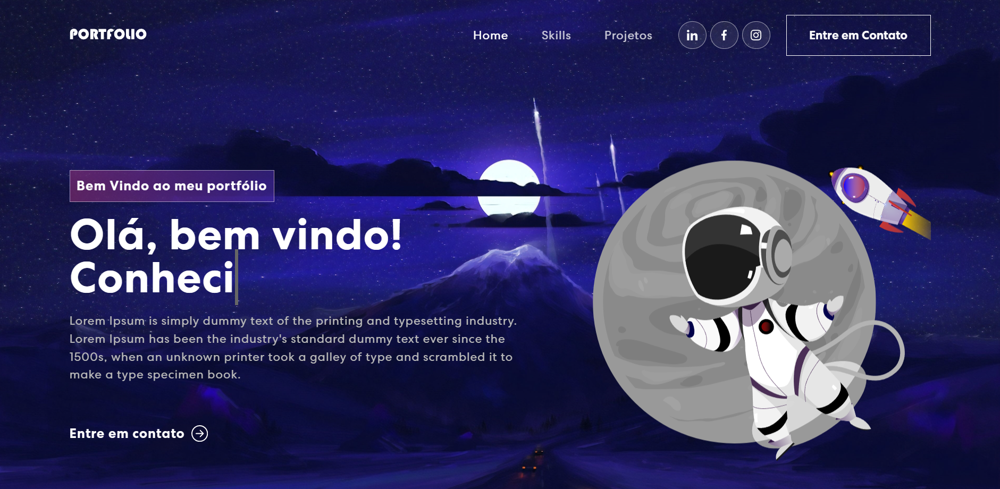

# Portfolio Website in React

This project was bootstrapped with [Create React App](https://github.com/facebook/create-react-app).

Construido usando:

- Front-end library: React
- CSS framework: React-bootstrap
- CSS animations library: Animate.css

No /portfolio, você pode:

### `npm start`

Executa a aplicação no modo de desenvolvimento.\
Abra [http://localhost:3000](http://localhost:3000) para visualizar.

### `npm test`

Lança no modo de teste.\
Veja a seção sobre [running tests](https://facebook.github.io/create-react-app/docs/running-tests) para mais informações.

### `npm run build`

Constroi o app para produção
Veja sobre [deployment](https://facebook.github.io/create-react-app/docs/deployment) para informações adicionais.
